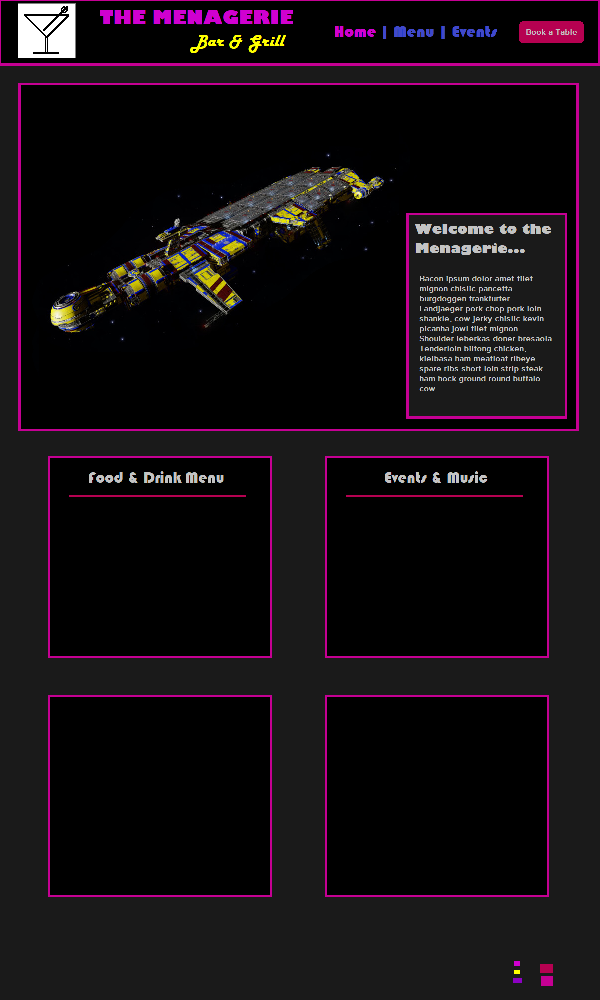
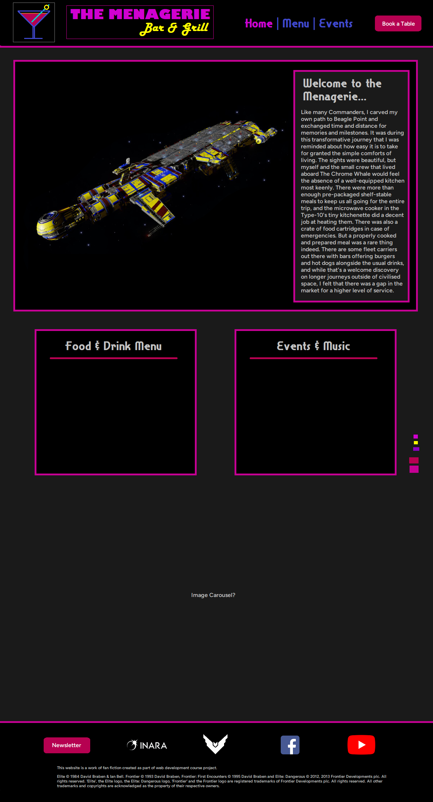
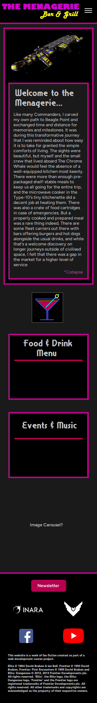

# mp1-menagerie-bar-and-grill
A website for a fictional dining establishment within the Elite Dangerous universe

---

# Menagerie Bar & Grill

Welcome to the **Menagerie Bar & Grill** - your hottest new dining destination.
Our restaurant aims to serve a wide range of tasty, crowd-pleasing meals made with quality ingredients and diverse techniques, all in a casual atmosphere with handcrafted cocktails and a broad choice of beers, wines and spirits. Our rotating schedule of live events will create the perfect setting for any occasion.

This website was designed to give guests a taste of what we offer, from browsing our menu to reserving a table for a special night out.

---

## Explore the Website

### Home

* Get a first impression of the Menagerie with bold imagery and a warm welcome.
* Learn what makes us unique as both a bar and a restaurant.

### Menu

* Browse our carefully selected food and drink menus.
* Discover chef’s specials and festive offerings.

### Events & Booking

* Stay informed about upcoming events, such as live DJs, quiz nights, and themed parties.
* Reserve a table through our simple booking form.

### Footer

* Find our location and opening hours.
* Connect with us on social media to keep up with the latest news.

---

## Why Visit Us Online?

* **Plan your night out** by checking our weekly events.
* **Browse our menu** before you arrive, so you already know your new favourite dish.
* **Reserve your spot** quickly with our booking form.
* **Stay connected** through social media links and contact information.

---

## Technologies Behind the Website

* **HTML5 & CSS3** - To create a modern, responsive design.
* **Bootstrap 5** - For layout, styling, and mobile-first responsiveness.
* **GitHub Pages** - Hosting the live site.

---

## Wireframes

### Initial draft for the index.html

### Final draft wireframe for desktop

### Final draft wirefram for mobile

---

## Visit the Site

[Live Website](https://stevenwilliams604.github.io/menagerie-bar-grill/)

---

### Sources and acknowledgments

* Snappy Service font downloaded from https://www.1001fonts.com/snappyservice-font.html
* Screenshots from the Elite Dangerous video game by Frontier Developments
* Additional stock imagery from pexels.com and pixabay.com

---

## Looking Ahead

We’re always aiming to improve. Future versions of the site may include:

* Online ordering for takeaway and delivery.
* A gallery showcasing our dishes, cocktails, and events.
* Customer reviews and testimonials.

---

✨ *The Menagerie Bar & Grill is a fictional establishment, created as part of a web development course project.*
